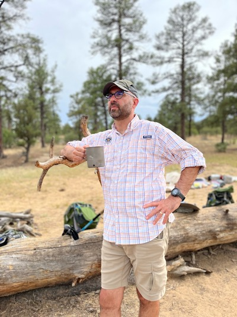

+++
title = 'About'
readTime = false
hideBackToTop = true
+++

Topo Beta is designed and written by Charlie Penner (that's me ⬇).

I've been living in Tennessee since 2012, and went on my first "real" backpacking trip in 2015. Despite my relative lack of readiness and the plentiful amount of rain encountered on that trip, I hobbled home knowing that backpacking was something I loved doing. In the time since then I've come to greatly appreciate the variety of terrain and hiking opportunities that exist in the area. From local parks to state and national parks (including America's [most visited national park](https://www.nps.gov/grsm/index.htm)), as well the highest peaks on the inimitable [Appalachian Trail](https://appalachiantrail.org/), an abundance of hiking and backpacking opportunities exist across the Volunteer state.

**I started Topo Beta to help people get information about hiking and backpacking with a general focus on the Tennessee area.** If you follow along, you'll find regular updates about [**destinations**](/tags/destinations) (where are some good places to hike?), [**techniques**](/tags/techniques) (how can you get started or become a better hiker?), [**gear**](/tags/gear) recommendations (what do you need to go hiking?), and [**food**](/tags/food) (cooking in the backcountry is a little different).  **My goal is for Topo Beta to be practical and useful (aka Practically Useful).** You won't find information about glamping, or RVs, or cabin rentals, or whitewater rafting, or offroading, or birdwatching (to pick a few things). You definitely won't find obnoxious ads that takeover the site and make it frustrating to read.

If this sounds interesting to you, I hope you'll follow along!
