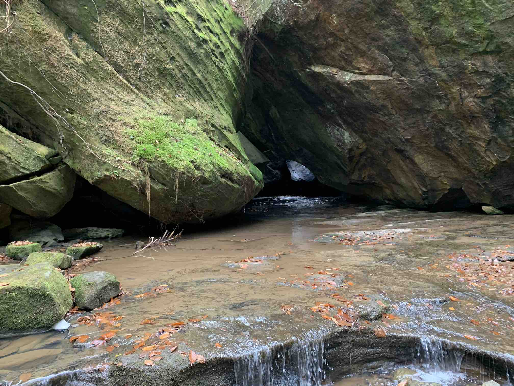
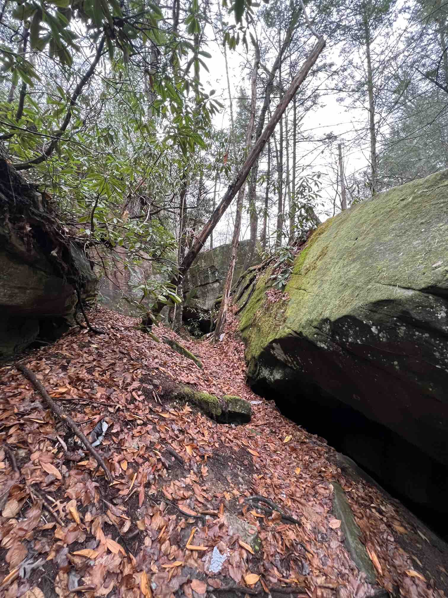
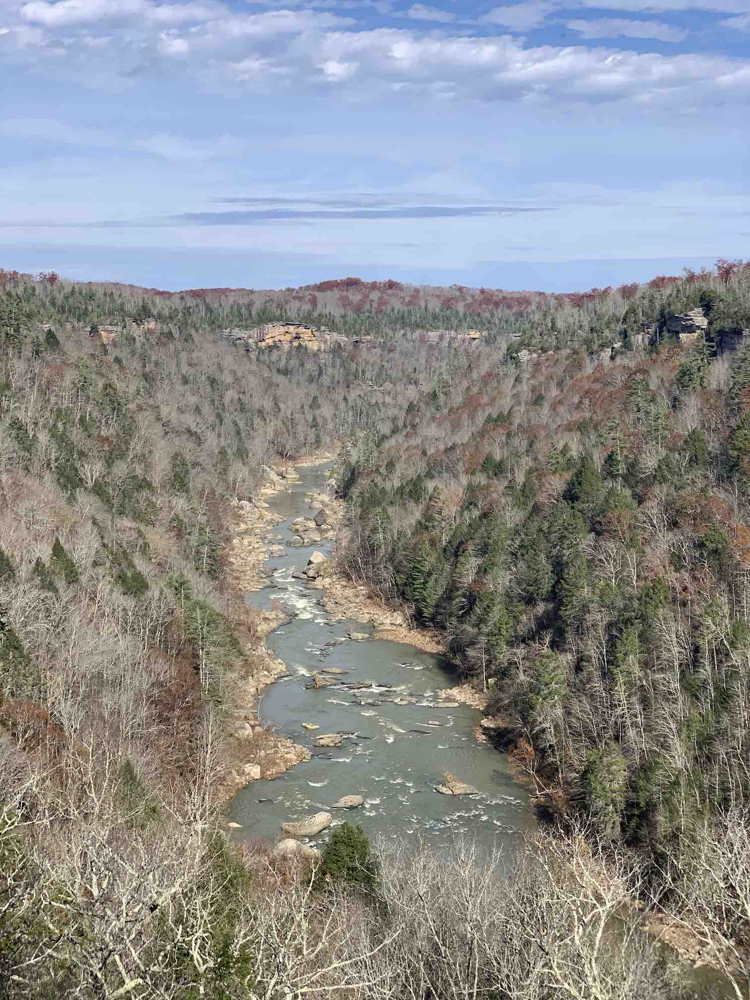
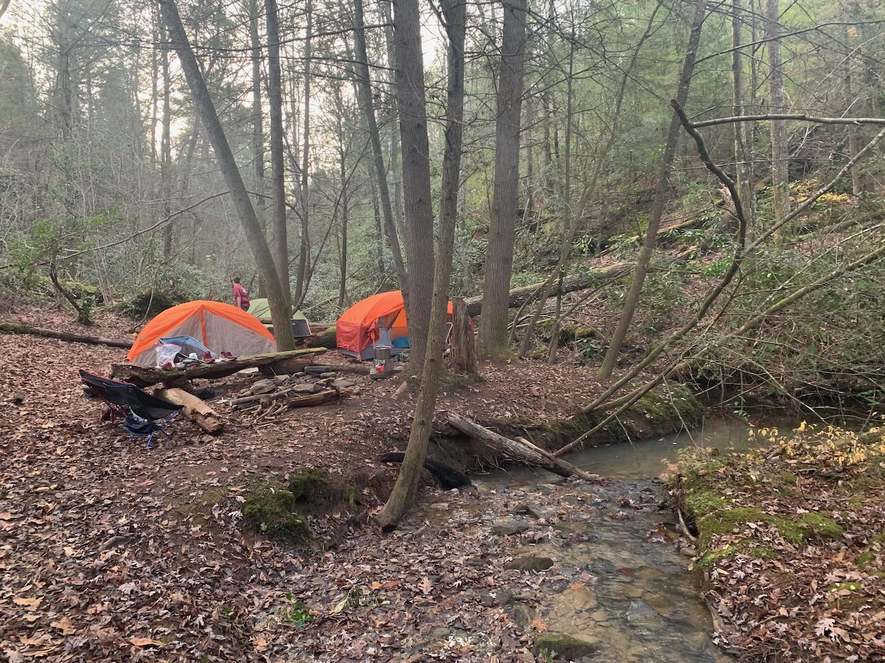

+++
title = 'Big South Fork Honey Creek'
date = 2024-10-02T12:00:00-05:00
summary = "One of the more interesting and challenging hikes in Big South Fork."
tags = ["treks"]
+++

The [Big South Fork National River & Recreation Area](https://www.nps.gov/biso/index.htm) is one of my favorite areas in and around Tennessee for hiking and backpacking. There’s everything from developed campgrounds to day hikes to primitive fully dispersed camping. There are high overlooks, caves, waterfalls, natural bridges, amazing rock formations, varying types of forest, and enough trails to easily spend several weeks hiking if you wanted to. There’s a good selection of maps and books available that capture lots of relevant details (see the Resources section below for a few of my favorites).

Within the park, the Honey Creek Loop is one of the more interesting hikes you can take. It’s not the longest (it works either as a day hike or an easy overnight), but it’s one of the more technically challenging. The last time I hiked this with a group of Scouts I spent a lot of time asking myself whether I’d allotted too much time for the hike since the entire loop is less than 5 miles. When we finally reached our campsite for the evening I realized that I had in fact allotted the correct amount of time - the technical nature of the trail means it’s slow going.

On the surface this trail doesn’t stand out as one that’s particularly strenuous. It clocks in at 4.2 miles with 869’ of ascent and 873’ of descent. Not too bad. What’s left out of that terse summary is how steeply some of that elevation changes in places, the rocky streams you’ll have to traverse, the bouldered houses you’ll have to shimmy through, and several places where the trail almost doubles back on itself, making it easy to become disoriented with where you’re at. 

## HITTING THE TRAIL

I prefer to hike this counterclockwise, partly because that’s how I’ve always done it, and partly because that’s how the NPS recommends you do it. The main trailhead has a reasonable amount of parking (probably around 20 cars?). The loop terminates in the middle of the parking area, but you’ll want to head to the north west end of the parking area where you’ll find the trail picking up from the gravel road (initially heading south before fairly quickly turning east).

The first mile or so of the trail is pretty woodsy, and generally declining in elevation. There are a few campsites along this stretch, but it’s probably too early in the hike to consider setting up camp if this is all you’re hiking on this trip. Somewhere around 1/2 of a mile in you’ll start to walk alongside a small feeder stream that’s descending down to the Big South Fork Cumberland River. There are some large rocks along this stretch, and some massive rock overhangs, but overall the trail is fairly straight forward at this point.

Somewhere close to the 1.5 mile mark there’s a fun detour available up to a nice high overlook. There are ladders/steps built into the side of the cliff that you can climb up. Once you arrive at the top there are some great views of the river, a small parking area and primitive restroom, along with some trash receptacles. If the thought of climbing almost straight up the ladders with a full pack on is daunting as you stand at the bottom, you may want to ditch your pack here for the climb up. 

After this point is where the trail gets particularly interesting to me. It won’t be long before you’ll be traversing around and across stream beds. You’ll be navigating across and between large boulders. The going is slow here. About 2 miles in the trail does its first double back, it should be fairly well marked, just pay attention and know that after it makes a hard turn back to the south east it won’t be long before you see the trail you recently walked just down the hill. There are several waterfalls along the way, and a large rock house (it looks like a cave but technically it’s not deep enough to be considered an actual cave).

There are several nice campsites around the 3 mile mark - one or two just before it, and several just after it. There’s generally plentiful water along the trail, and several of the sites are right next to a stream. If you stop to camp in this area, you’ll have an easy hike out the next morning through a more typical open woodsy trail.

### POSSIBLE EXTENSIONS

- If you’re looking for a slightly longer hike in this area a nice option is to include a trip to or from the Burnt Mill Loop. It’s about 4.3 miles from Honey Creek, and an additional 4.4 miles on its own. Alternatively you could head north to the Leatherwood Ford area, about 5.5 miles from the north west corner of Honey Creek Loop.
- The western side of Honey Creek Loop is part of the [Sheltowee Trace](https://sheltoweetrace.org), a 343 mile National Recreation Trail that starts in the Daniel Boone National Forest in Kentucky and finishes just south of Honey Creek Loop at the Burnt Mill Loop trailhead. If you hike this during the late fall you may run into thru hikers working through some of their last sections of the [Hiker Challenge](https://sheltoweetrace.org/hiker-challenge) that the Sheltowee Trace Association coordinates.

## ONLINE MAPS

- [AllTrails](https://www.alltrails.com/trail/us/tennessee/honey-creek-loop?u=i&sh=wyzdkf)
- [GaiaGPS](https://www.gaiagps.com/map/?loc=15.2/-84.6589/36.4213&layer=GaiaTopoRasterFeet&knownRouteId=238516)

## OTHER RESOURCES

Looking for more info on this destination? Here are a few maps and books that I’ve found useful, some free from the NPS, and a few that are worth buying if you’re going to be doing much hiking in Big South Fork.

- National Park Service - Big South Fork
    - [Popular Overnight Hiking Trails](https://www.nps.gov/biso/planyourvisit/popular-overnight-hiking-trails.htm) (pdf)
    - [Honey Creek Loop Map](https://www.nps.gov/biso/planyourvisit/upload/Hike-5-Honey-Creek-John-Muir-Burnt-Mill-Backcountry-Hiking-Route-18-1_1_10_15.pdf) (pdf)
- [National Geographic Trails Illustrated Map](https://www.natgeomaps.com/ti-241-big-south-fork-national-river-and-recreation-area)
- [Hiking The Big South Fork](https://a.co/d/dXI4Tup) (book)
- [50 Hikes on Tennessee’s Cumberland Plateau](https://a.co/d/43XFarT) (book)