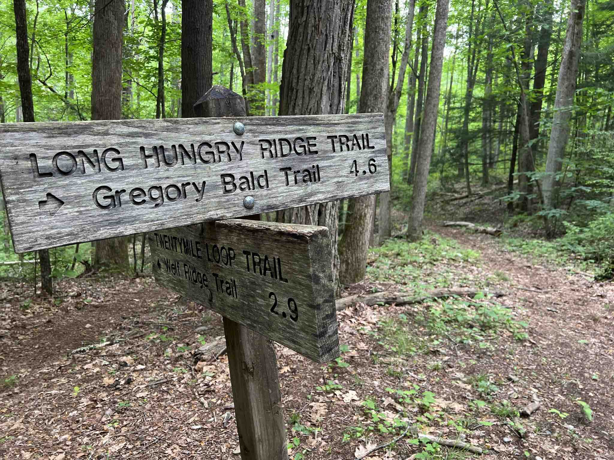

+++
title = 'Hitting the Trail'
date = 2024-10-01T12:00:00-05:00
tags = ["techniques"]
summary = "What is Topo Beta all about anyways?"
+++

### HELLO WORLD

When I have a backpacking trip coming up, I start to feel the anticipation of the trip as the date gets closer. I start reading and re-reading maps and area guides, searching for new information, monitoring the weather forecast, planning my menu, packing my gear, and making any last minute preparations.  Most of the trips I do are within a few hours of my home, so I’ve got a drive ahead of me, and I’m often loaded up with a group of Scouts from the Troop that my boys and I are part of.  Finally we get to our destination, unload our gear, double check our maps, and hit the trail.  Thus begins the journey of the next day or two. The trail bends and winds, goes up and down, and we follow it wherever it leads until we return to the starting point, and head back home.

Today marks the beginning of another kind of “trail” I’m exploring called **Topo Beta**. There are obviously a lot of differences between building something online and an actual trail. One of the main differences is that there’s no map that outlines how and where things will go. There’s no marked trail, no topographical markings to alert me to a steep hill, no distance markers telling me how far until my next water source. It’s a bit more like bushwhacking or orienteering - I’ve got an idea of where I want to go and how I want to get there, but until I get out there, I don’t know what awaits me. 

### THE PLAN

My goal is straight forward: **I’d like for Topo Beta to become a respected resource for hiking and backpacking**. Most of the hiking that I do is in the greater Tennessee area. There are four main categories that I’ll be focusing on as the journey starts:

- **Treks**: There are a lot of great places to go hiking and backpacking in and around Tennessee. I’ve been to a lot of them, and am always trying to get to more of them. I’ll be creating “beta packets” for various destinations and trails throughout the area, with notes and details to help you plan your own adventures. *Are you looking for an easy hike for a large group or a challenging hike for a few people? Do you want to do a day hike and be home for dinner or are you looking for a weekend (or longer) adventure?*
- **Techniques**: Hiking is arguably one of the easiest activities to take up - you just start walking. However, as with any pursuit or hobby that you build more than a casual relationship with, there are techniques you can learn and skills you can hone that will help you enjoy the experience more. I’ll be writing about things that I’ve learned and refined along the way with the goal of helping you do the same. *What’s the best way to start a fire? Where should I start when planning a trip? What should I consider when picking a tent site?*
- **Gear**: There are entire sites and YouTube channels dedicated to reviewing all sorts of gear used in the outdoors. I’m not interested in competing with those sites. Rather, I’ll be sharing my experience with specific pieces of gear, helping you think through what types of gear you need (spoiler alert - just because the big box store says you need it doesn’t mean you do), and even some clever “hacks” along the way that work just as well or better than buying something outright. *What are some good ways to make coffee on the trail? What type of stove should I take backpacking? Are these $$$ tent stakes worth it?*
- **Food**: I like to eat. You need to eat - whether you like to cook or not.

In addition to working to post great content on a regular basis, I’ve designed the site to be pleasant to read. I’m sure you’ve visited plenty of sites that are inundated with ads and popups and cookie warnings. Those might be useful or necessary for some things, but they sure aren’t useful or beneficial for the reader. There won’t be any ads here at the beginning, but if we reach a point where they make sense, they’ll be done in a tasteful and minimalistic way that doesn’t detract from your reading experience. If you prefer to read with an RSS reader (like I do), there’s a full content feed available.

### HIKE ON

When I’m out hiking with a group of Scouts, we use the following call and response pattern to determine if the group is ready to start hiking again.

- Crew Leader: *“Is anyone NOT ready?”*
- Crew: *“I’m still putting my pack back on”* OR *“I’m still resting/eating/otherwise not read*” OR *silence*

If there’s *silence* (which is a relative term in this instance), that means the group is ready to start hiking again. At that point the crew leader will have some sort of saying to let everyone know we’re heading out. These vary wildly in creativity and silliness. Perhaps a favorite song lyric or movie quote, or some sort of inside joke with the crew. A good fallback if they’re not feeling particularly creative is “hike on!”. 

I wrap up this post with an enthusiastic “Hike On!” - I hope you’ll consider **subscribing** at the link below and following along with this journey.